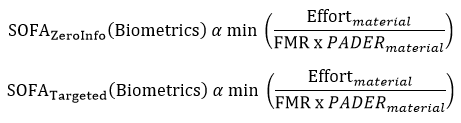

## 6. Conclusion
At the conclusion of Section 2, two proportions were presented for SOFA-B: one for zero information attacks and another for targeted attacks. Section 4 included discussion on determining the PAD error rate by testing a suite of materials. This has implications for the basis of the Effort computation: Effort should also be computed per material tested. These values of Effort and PAD error should be used to compute SOFA-B scores to determine the minimum strength. Following the “weakest link” principle, the minimum SOFA score shall be used to characterize the strength of the authenticator.

NIST continues to research and develop the proposed SOFA equation to better understand the inherent strength of authentication systems. A number of opportunities exist for further study beyond this document, especially for the factors identified within this paper. Better defining Effort; understanding the dependencies between FMR and PADER; and determining the appropriate testing methodologies and representative types of artefacts for the two measures are a few of the opportunities for expansion. Once measures for inherent strength in biometrics mature appropriately, methods for comparing biometric systems against other authentication systems using the same type of quantitative measures will be the next focus for NIST work in this space.

Feedback is welcomed and highly encouraged as NIST continues this work. This document will be iteratively reviewed and updated based on community feedback. That feedback will be instrumental for determining the appropriate venue for additional work in the future. Comments can be emailed to sofa@nist.gov or posted on GitHub during the public comment periods.

## References and Notes

1 “Advanced Identity Workshop: Applying Measurement Science in the Identity Ecosystem” at NIST’s Gaithersburg, Maryland, campus.

2 Inspired by vulnerability diagram in ISO/IEC 30107-1: 2016 and N.K. Ratha, J.H. Connell, R.M. Bolle, “Enhancing security and privacy in biometrics-based authentication systems,” IBM Systems Journal, Vol 40. NO 3, 2001.

3 National Institute of Standards and Technology, “NISTIR 7296 MINEX04: Performance and Interoperability of the INCITS 378 Finger Print Template,” March 21, 2006. http://spin1-www.nist.gov/customcf/get_pdf.cfm?pub_id=150619&_ga=1.248059719.1159721241.1435844400

4 ISO/IEC 19795-1:2006

5 ISO19795-1

6 ISO19795-1

7 Testing requirements for biometrics systems are also covered in: ISO/IEC 19795-1:2006, ISO/IEC 19795-2:2007, ISO/IEC TR 19795-3:2007, ISO/IEC 19795-4:2008, ISO/IEC 19795-5:2011, ISO/IEC 19795-6:2012, ISO/IEC 19795-7:2011

8 Generalized best practices can be found in ISO19795-1 while guidance on modality-specific testing can be found in ISO19795-3

9 ISO/IEC 30107-1:2016

10 ISO/IEC 30107-1:2016

11 Attack potential is defined in ISO/IEC DIS 30107-3 as “measure of the effort to be expended in attacking a TOE, expressed in terms of an attacker's expertise, resources and motivation.”

12 An independent lab may choose to combine the latter method with unknown PAIS that fall in the same attack potential level.

13 E. Newton, S. Schuckers, “Recommendations for Presentation Attack Detection: Mitigation of threats due to spoof attacks,” International Biometric Performance Conference, 2016.

14 Schuckers, Stephanie, "Presentations and attacks, and spoofs, oh my." Image and Vision Computing, April, 2016. http://www.sciencedirect.com/science/article/pii/S026288561630052X 
