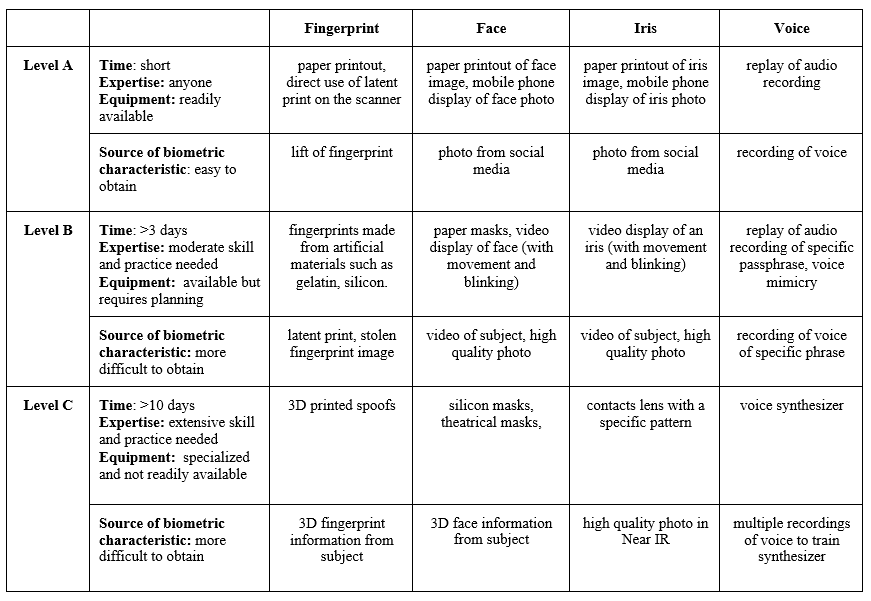

## 3. FMR and PADER Testing

### 3.1. Matching Error Rates
Statistical analysis is essential when evaluating the performance and accuracy of matching algorithms and systems. Two characteristics of this analysis are of particular importance: Type 1 and Type 2 errors, or FMR and FNMR, respectively. 

This document focuses on FMR, rather than FNMR, and how it affects the measurement of strength of an authentication system. FNMR can be described as a measure of user inconvenience, while FMR is regarded as a “measure of security.”3

### 3.2. Determining FMR and FNMR

#### 3.2.1. False Match Rate
A zero-effort imposter attempt occurs when “an individual submits his/her own biometric characteristics as if he/she were attempting successful verification against his/her own template, but the comparison is made against the template of another user.”4  FMR is defined as the “proportion of zero-effort imposter attempt samples falsely declared to match the compared non-self template.”5  In other words, out of a total number of imposter attempts, the FMR is the percentage of those attempts that improperly result in a match.

#### 3.2.2. False Non-Match Rate
A genuine transaction occurs when an individual submits his/her own biometric characteristics to be compared against their own biometric template.  These samples are from the same individual and should result in a match. FNMR is defined as the “proportion of genuine attempt samples falsely declared to not match the template of the same characteristic from the same user supplying the sample.”6 In other words, out of a total number of legitimate attempts, FNMR is the percentage of those attempts that improperly results in a non-match.

#### 3.2.3. Match Rate Interdependence
When two biometric samples are compared, a biometric system will generate a similarity score. For example, a range of similarity scores may be 1 (for low similarity) to 100 (an exact match). A match or non-match decision is made based on where this score falls with respect to a decision threshold; a value above the threshold is considered a match, and a value below the threshold is considered a non-match. Setting this threshold is a risk-based decision because it results in errors, as some number of true match scores will fall below the threshold, while some true non-matches will fall above it. Changing the decision threshold to a higher value will decrease false matches, but it will also increase false non-matches. In other words, the FMR and FNMR are interdependent: adjusting the biometric system to decrease one of these rates will increase the other.

As discussed above, with respect to SOFA-B for zero information attacks, the statistic that is of interest is the FMR because it is a measure of the degree of difficulty to find an imposter that randomly matches a legitimate user. FNMR is a measure of convenience, signifying how often a legitimate user will be rejected. However, when FMR is measured, it is necessarily measured at an FNMR level because the two statistics are interdependent.

#### 3.2.4. Testing Requirements
Empirical testing is required to determine the FMR of a biometric system, which is both an assessment of the inherent distinctiveness of the modality (answering the question: How well does this biometric pattern differentiate between individuals?) as well as of the matching performance of the particular biometric system under evaluation. Testing requirements for biometrics are covered in ISO/IEC 19795-1, and other parts of ISO/IEC 19795, depending on testing needs.7 ISO/IEC 19795-1 provides formulae for the number of subjects that need to be tested for statistically significant results.

The distribution of sample data is critical to measuring performance characteristics when testing algorithms in an offline manner. To obtain the most accurate results, the sample data should be distributed in a way that best reflects samples that will be collected while in operation. One way to verify performance measures is to run internal testing on in-house data. While this is good for initial testing and validation, third-party testing should be done to produce unbiased and independent results.8 

### 3.3. Presentation Attack Detection (PAD)
One of the challenges in implementing biometric authentication systems is deploying safeguards to mitigate against presentation attacks, commonly known as biometric spoofing. This is especially true in uncontrolled environments where there is not an operator monitoring the placement or capture of a biometric. There are multiple ways to mitigate the risk of a successful presentation attack. The class of methods created to directly counter these attempts at the biometric sensor is known as PAD.

PAD is defined as “automated determination of a presentation attack,” which is a “presentation to the biometric data capture subsystem with the goal of interfering with the operation of the biometric system.”9 Categories of PAD include Artefact Detection (AD) and Liveness Detection (LD).

Error rates for PAD are expressed as classification errors. A PAD subsystem may incorrectly classify a bona fide presentation as an attack presentation or vice versa. To measure the strength of function for biometric authentication, the error of interest occurs when a PAD subsystem fails to detect an attack presentation, allowing an attacker positive access to an authorized user’s account.

At the PAD subsystem level, this error rate is known as the Attack Presentation Classification Error Rate (APCER) and is defined as the “proportion of attack presentations using the same Presentation Attack Instrument (PAI) species (PAIS) incorrectly classified as bona fide presentations at the PAD subsystem in a specific scenario.”10  At the biometric system level, this error rate is called the Imposter Attack Presentation Match Rate (IAPMR), which expresses the ratio of imposter attack presentations, all made with the same material, that are successfully matched to the targeted user (at a fixed operating threshold for the matching algorithm). In other words, IAPMR is the measure of the ability of a spoofed biometric to not only bypass the PAD subsystem but to be authenticated as a bona fide user.

#### 3.3.1. Measuring and Characterizing the Performance of PAD
PAD error rates, such as IAPMR, must be determined through empirical testing. The goal for PAD testing is to test a set of materials (or PAIS) that represent an attack potential level and determine the max error rate found among those materials.

Prior to testing, the initial step must be taken to identify the use case for the biometric product. The specific application will have an expected level of risk or attack potential, for which a set of PAIS should be evaluated to determine the rate that the biometric system rejects (and falsely accepts) each PAIS.11  To characterize the performance of the PAD at a given attack potential, the PADER of the most successful attack is used. However, to determine SOFA-B, both the PADER and the Effort required to create the PAIS are taken into account. As will be demonstrated in the Conclusion, the combination that yields the lower value determines the SOFA-B.

Attack potential levels represent increasing levels of Effort to mount an attack. Table 1 shows examples of two approaches for testing to determine the PADER: using the criteria of time, expertise, equipment, and source of the biometric characteristic to choose PAIS to test (in the second column) or testing a list of known attacks for a modality, preferably developed by a body of experts.12

**Table 1**13, 14 Spoof presentation attacks separated by levels based on time, expertise, and equipment

#### 3.3.2. Reporting, Considerations, and Principles for PAD Testing
Testing and reporting requirements for PAD testing are provided in ISO/IEC DIS 30107-3. There are additional aspects of testing that need to be considered to carry out an evaluation, including: 

-	How many subjects should be represented in the N samples that are tested? Is it best to have as few as possible, as many as possible, or a diverse set with a small number of replicates per subject? 
-	What size should N be for statistical significance? What amount of error can be tolerated?

The following represent current best practices and principles for PAD testing:

-	Testing by an independent party yields more reliable results for relying parties/consumers.
-	PAD system performance may vary greatly in an evaluation depending on whether the PAIS are known or unknown to the producer of the biometric system. Therefore, specifics about some PAIS that will be tested should not be disclosed to the company submitting a product for testing. 
-	Certification of PAD performance should be valid for only a limited period of time. 
-	Test results are more likely to reflect real-world results if the test data is representative of operational data. 

#### 3.3.3. Limiting the Number of Unsuccessful Attempts
There are limits to what can be learned from testing PAD subsystems due to both the paucity of knowledge regarding how best to conduct testing (e.g. number of subjects versus number of samples) and the inherent uncertainty in this space due to the infinite PAI that could be used to attack a biometric system and evolving threats over time. Therefore, a biometric sensor must have a maximum number of unsuccessful attempts, after which the biometric sensor will no longer be available for authentication. That number can be set sufficiently low, such as ten attempts, or it could be related to the testing results and the max IAPMR, so that the limit is equal to or less than half of the number of thwarted attacks observed in testing for the most successful attack type.

## 4. Determining Effort
**[This section is a place holder. Contributions are welcome; and more developments will be inserted here following the GIS workshop on September 20, 2016.]**

Effort is listed as a third factor for the proposed SOFA measure as it has the potential to serve as a shared, level-setting metric between different authenticator types. How Effort is determined is not yet established, though time, knowledge, and resources required for an attack will likely contribute to this measure. The potential consequences for an attacker being caught, or the difference between “zero-information” and “targeted” attack scenarios, could also be considered. Future studies of Effort may benefit from a normalized scale that spans across authenticator types for the purpose of comparison.

## 5. Baseline Security
**[This section is a place holder. Contributions are welcome; and more developments will be inserted here following the GIS workshop on September 20, 2016.]**

Many of the vulnerabilities present within a biometric system, as illustrated in the attack diagram in 2. *Equation/Ratio*, are mitigated in the same way as vulnerabilities for other technologies. The two broad categories of these vulnerabilities are protecting **data in transit** and **data at rest**.
