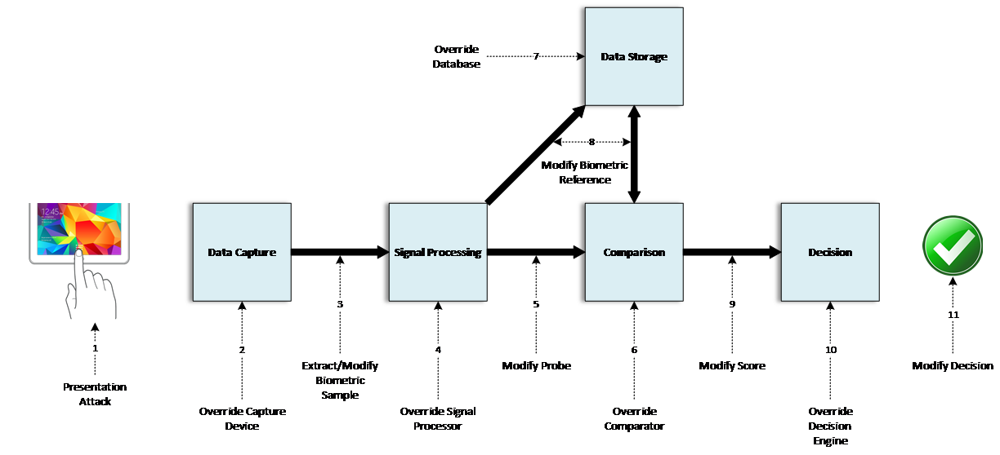
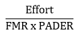
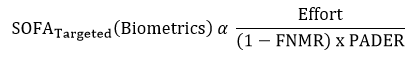

## 2. Analysis of Strength of Biometric Authentication
During authentication, a typical biometric system follows a flow whereby:

1.	A biometric pattern is presented.
1.	That data is captured via a sensor.
1.	Signal processing typically takes place.
1.	A comparison of the captured data takes place, against reference data retrieved from storage.
1.	An authentication decision is made.

The diagram below2 depicts 11 points in a system where an attacker could potentially interject into the flow to interfere with the decision. These 11 elements may all be self-contained within a single device (such as a mobile device) or distributed across multiple physical systems.

Many of these vulnerabilities fall into familiar categories that are found in other authentication systems, such as protecting data in transit and data at rest, and cyber security controls should be used to mitigate security risks in the same way for biometric systems as would be required of other information systems. There are two notable vulnerabilities that that fall outside the protection that can be provided by core cyber security controls:

- **Presentation Attack (1)** – This marks the point at which an attacker may present a fake biometric to a sensor. The failure of the system to detect an imposter making a presentation attack may generally be referred to as the **Presentation Attack Detection Error**. The **Presentation Attack Detection Error Rate (PADER)** may be determined through testing and is referred to as the Imposter Attack Presentation Match Rate (IAPMR) when the biometric system is tested as a whole.
- **Override Comparator (6)** – This marker includes the sub-process of the comparator, the algorithm that compares an input from the sensor to a stored biometric sample for a user.  The performance of the comparator is a key component of a biometric system, which would ideally have low false match and false non-match rates.  The performance of the comparator depends on two major factors:  how distinctive the biometric pattern is (i.e., the modality's innate features and how many distinct individual patterns may exist) as well as the approach of a vendor's algorithm to analyze the modality. The probability of an imposter being successfully matched to a claimed user's biometric characteristics is the **False Match Rate (FMR)**, and it is determined through empirical testing to get an imposter distribution.

The focus on these two specific factors is based on their unique characteristics relating to capturing, processing, and matching data during biometric authentication. These factors are also highlighted as there is an assumption that the organization will have an adequate level of “cyber hygiene” related to the core security controls that are in place prior to attempting to quantify biometric system strength. Failure to maintain proper cyber hygiene will result in a system that can be attacked by non-biometric specific means and renders any inherent strength of function score invalid.

Other compensating controls may also be utilized, in addition to those used in the biometric system, to improve the overall security of the system. However, such controls fall outside of the scope of this paper.

With these factors taken into consideration, the proposed strength equation is based on isolating the quantifiable aspects of these biometric technologies for a measure of inherent strength. The variables for the strength equation are covered in this document and include:

- **FMR** - The probability of a false match occurring during the comparison phase.
- **PADER** - The probability of a successful presentation attack during presentation of the biometric sample.
- **Effort** - In addition to FMR and PADER, the strength equation includes Effort to account for the combination of time, knowledge, resources, and potential consequences tied to conducting an attack.

FMR and PADER can be combined to produce a measure that is comparable to password entropy, with the assumption that the two factors are independent of one another. (Dependencies may exist between the two, though the extent of that dependency will have to be explored further.) FMR and PADER are two key components of determining the inherent biometric system strength, but the level of Effort required to attack specific components of an authentication system should also be considered, as an attack that requires a level of effort that is disproportionate to the reward may deter attackers.

With FMR, PAD, and Effort serving as the major inputs, the resulting equation for measuring the SOFA becomes:

This equation considers a “zero-information” or *“a priori”* attack scenario where the attacker is not aiming to pose as a specific individual but is attempting to gain access by chance.  This is analogous to a "brute force" attack on passwords. The equation for a “targeted” attack scenario is changed to reflect that the attacker would likely create a sample that closely resembles an approved individual’s biometric characteristics and therefore the True Match Rate, or one less the False Non-Match Rate (FNMR), is a better approximation (than the FMR) for the probability of a successful attack.

### 2.1. Effort
[This section is a place holder. Contributions are welcome. And more will more developments will be inserted here following the GIS workshop on September 20, 2016.]

The level of effort required to attack a biometric authentication system varies across the two scenarios under consideration:  “zero-information” and “targeted” attacks. The following table lists some of the potential factors and techniques that could affect the level of effort required for attacks on password/PIN-based systems and biometric-based systems. 

| Password/PIN         | Biometrics     |
| -------------------  |----------------|
| Zero-information:   -Length and complexity | Zero-information:   -Sample size and complexity   -Access to sensor/device   -Computational complexity of matching         |  
| Targeted:   -Shoulder surfing   -Checking notepads | Targeted:   -Retrieving the biometric sample   -Creating an artefact |

Biometric attacks generally require more effort than attacks on PINs and passwords. Whereas the complexity of attacking a password with no prior information is based solely on the entropy of that password, “zero-information” biometric attacks may require determining the scope of the biometric sample based on factors such as:  creation of the sample and computational complexity. 

We presume that “targeted” biometric attacks require obtaining a valid sample and recreating it for use during presentation, and this may also require substantial time, knowledge, and resources.

How effort is determined is not yet established, though time, knowledge, and resources required for an attack may contribute to this measure. The potential consequences for an attacker being caught against the value gained from a successful attack may also be considered. However, any number of factors could be incorporated may vary across modalities. Future efforts may benefit from a normalized scale that spans across authenticator types for the purpose of comparison. 

2Taken from ISO/IEC JTC 1/SC37 and other documents.
